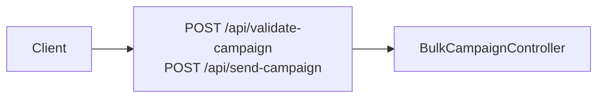

# Bulk messaging: routes and controller scaffold

## Current state (already in the repo)

- API prefix is `api` ([`app/Providers/RouteServiceProvider.php`](app/Providers/RouteServiceProvider.php)), so new routes become **`POST /api/validate-campaign`** and **`POST /api/send-campaign`**.
- [`routes/api.php`](routes/api.php) already `require`s [`routes/api/messaging.php`](routes/api/messaging.php) — no change needed there unless you prefer a **second** route file (see below).
- Controllers already live under [`app/Http/Controllers/Messaging/`](app/Http/Controllers/Messaging/) (`WhatsAppMessageRequest`, `MessageController`, etc.).

So this work is **additive**: new controller class + two routes in the existing messaging routes file.

## Implementation steps

### 1. New controller in `Messaging`

Create something like **`app/Http/Controllers/Messaging/BulkCampaignController.php`** (name can be adjusted to your taste) with two public methods, for example:

- `validateCampaign(Request $request)` — placeholder `return response()->json([...], 501);` or empty validation stub until business rules exist.
- `sendCampaign(Request $request)` — same until send pipeline is implemented.

Match project style from nearby controllers: namespace `App\Http\Controllers\Messaging`, appropriate `use` for `Illuminate\Http\Request`, JSON responses consistent with [`CampaignController`](app/Http/Controllers/Campaign/CampaignController.php) / existing APIs.

### 2. Register routes in `routes/api/messaging.php`

At the top, add `use` for the new controller. Append a small grouped section, e.g.:

```php
// ─── Bulk campaign messaging ─────────────────────────────────────────────────
Route::post('validate-campaign', [BulkCampaignController::class, 'validateCampaign']);
Route::post('send-campaign', [BulkCampaignController::class, 'sendCampaign']);
```

**Middleware (decision):** Many campaign mutations in [`routes/api/campaign.php`](routes/api/campaign.php) use `['auth:api', 'check.permission:View Campaign']`. Plan to apply the **same** middleware to both bulk endpoints unless you explicitly want them public (unlikely). If you use a different permission name for “send”, that can be swapped in a follow-up.

### 3. Optional: separate route file

If you want these two routes in a **dedicated** file (e.g. `routes/api/bulk-campaign.php`) instead of growing `messaging.php`:

- Add the file with the two routes + imports.
- Add `require __DIR__.'/api/bulk-campaign.php';` in [`routes/api.php`](routes/api.php) (placement next to `messaging.php` is fine).

Default recommendation: keep them in **`messaging.php`** unless you expect many more bulk-specific routes.

### 4. Out of scope for “create till here”

- Request validation classes, queue jobs, integration with [`WhatsAppMessagePayloadService`](app/Services/Messaging/WhatsAppMessagePayloadService.php), or campaign models — stub responses only until the next iteration.

## Summary diagram



No new folders are required under `Controllers` — only a new PHP class file under the existing `Messaging` directory.
