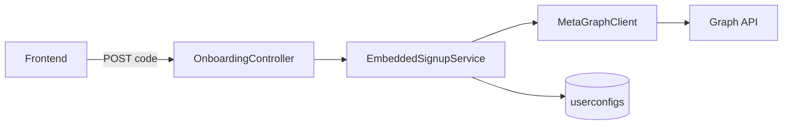

# Embedded Signup — Backend Plan (updated)

## Your question: incremental DB saves?

**Yes, you are right.** Saving only at the end (especially from the frontend across multiple async calls) is why values like the token sometimes never land in the DB. The backend should **persist after each successful Meta step**, not in one final blob.

Chosen behavior (per your answer): **keep partial data** + **`onboarding_status`** column so the UI knows setup is incomplete and can retry.

---

## Architecture (separate from proxy)



| Component | Path |
|-----------|------|
| Controller | [`app/Http/Controllers/Messaging/OnboardingController.php`](app/Http/Controllers/Messaging/OnboardingController.php) — `complete()` only |
| Service | [`app/Services/Meta/EmbeddedSignupService.php`](app/Services/Meta/EmbeddedSignupService.php) — orchestration + incremental saves |
| HTTP client | Reuse [`MetaGraphClient`](app/Services/Meta/MetaGraphClient.php) |
| Routes | Add to [`routes/api/meta.php`](routes/api/meta.php) under `messaging` + `auth:api` |

Do **not** put this logic in [`MetaProxyController`](app/Http/Controllers/Meta/MetaProxyController.php). Existing `POST /api/messaging/connect` remains step-0-only until frontend migrates.

---

## API contract

**Request:** `POST /api/messaging/onboarding/complete`

```json
{ "code": "<oauth_code_from_fb_popup>" }
```

**Success:**

```json
{
  "ok": true,
  "step_completed": 6,
  "onboarding_status": "completed",
  "waba_id": "...",
  "phone_id": "...",
  "phone_number": "919876543210"
}
```

**Failure (example — failed at register):**

```json
{
  "ok": false,
  "failed_at": 3,
  "step_label": "Register Phone",
  "onboarding_status": "phone_resolved",
  "error": "..."
}
```

Frontend still makes **one** call; progress is reflected in the response and in DB.

---

## Step flow with incremental saves

| Step | Meta call | DB write after success |
|------|-----------|-------------------------|
| 0 | `GET /oauth/access_token` | `meta_access_token`, `app_id` → status `token_exchanged` |
| 1 | `GET /debug_token` | `whatsapp_business_account_id` → `waba_resolved` |
| 2 | `GET /{waba_id}/phone_numbers` | `userconfigs.whatsapp_phone_id` + `users.whatsapp_number` (digits) → `phone_resolved` |
| 3 | `POST /{phone_id}/register` | status → `phone_registered` |
| 4 | `POST /{waba_id}/subscribed_apps` | status → `completed` |

On any Meta failure: return immediately with `failed_at` and current `onboarding_status`; do **not** roll back earlier columns.

---

## Database (actual schema)

- **`userconfigs`:** `app_id`, `whatsapp_business_account_id`, `meta_access_token`, `whatsapp_phone_id`, `business_account_id` (nullable); **no** `whatsapp_number` column
- **`users`:** `whatsapp_number` (`bigInteger`) — set in step 2, same as [`UserConfigController::create`](app/Http/Controllers/Settings/UserConfigController.php)
- Migration: add `onboarding_status` (nullable string) to `userconfigs`
- Relation: `User::userConfig()` hasOne; use `UserConfig::updateOrCreate(['user_id' => $user->id], ...)`
- Status values: `token_exchanged`, `waba_resolved`, `phone_resolved`, `phone_registered`, `completed`
- `EmbeddedSignupService::persistStep($user, array $configAttrs, ?string $phoneNumber, string $status)` — DB transaction per step

---

## Env

```env
META_APP_ID=
META_APP_SECRET=
META_API_BASE=https://graph.facebook.com/v25.0
WHATSAPP_REGISTER_PIN=401402
```

---

## Out of scope (this PR)

- Frontend `Embedded.js` changes (separate agent)
- Deprecating [`UserConfigController::create`](app/Http/Controllers/Settings/UserConfigController.php) accepting tokens from body (admin path may stay)
- Middleware blocking sends until `onboarding_status === completed` (follow-up)

---

## Docs

Update [`docs/META_MESSAGING_PROXY_API.md`](docs/META_MESSAGING_PROXY_API.md) with `onboarding/complete` when implemented.

Full step-by-step Meta details remain in [`.cursor/plans/EMBEDDED_SIGNUP_BACKEND.md`](.cursor/plans/EMBEDDED_SIGNUP_BACKEND.md) (updated for incremental saves + separate classes).
