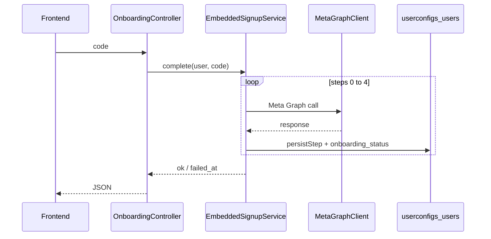

# Embedded Signup — Backend-Aligned Plan

## What changed in the doc

[`.cursor/plans/EMBEDDED_SIGNUP_BACKEND.md`](.cursor/plans/EMBEDDED_SIGNUP_BACKEND.md) was written for a generic Laravel app. It is now aligned with Waba:

| Frontend-agent assumption | Actual backend |
|---------------------------|----------------|
| Save `whatsapp_number` on `userconfigs` | **`users.whatsapp_number` only**; `userconfigs` has `whatsapp_phone_id` |
| `Http::` facade in controller | **[`MetaGraphClient`](app/Services/Meta/MetaGraphClient.php)** (`getWithQuery`, `get`, `post`) — same as [`MetaProxyController::connect`](app/Http/Controllers/Meta/MetaProxyController.php) |
| Route in `routes/api.php` | **[`routes/api/meta.php`](routes/api/meta.php)** under `prefix('messaging')` + `auth:api` (Passport) |
| One big DB save at end | **Incremental `updateOrCreate` after each Meta step** + `onboarding_status` |
| Monolithic 150-line controller | **`OnboardingController` (thin) + `EmbeddedSignupService`** |
| Sanctum / body `user_id` | **`auth()->user()`** only; do not use `POST /api/update-credential` for embedded signup |

Full Meta step details, frontend migration notes, and diagrams remain in the markdown file.

---

## Target API

```
POST /api/messaging/onboarding/complete
Authorization: Bearer {passport_jwt}
Body: { "code": "<oauth_code>" }
```



---

## Database writes per step

| Step | Meta | `userconfigs` | `users` | `onboarding_status` |
|------|------|---------------|---------|---------------------|
| 0 | OAuth exchange | `meta_access_token`, `app_id` | — | `token_exchanged` |
| 1 | debug_token | `whatsapp_business_account_id` | — | `waba_resolved` |
| 2 | phone_numbers | `whatsapp_phone_id` | `whatsapp_number` | `phone_resolved` |
| 3 | register | — | — | `phone_registered` |
| 4 | subscribed_apps | — | — | `completed` |

**Migration:** add nullable `onboarding_status` to `userconfigs`.

**Model:** [`UserConfig`](app/Models/Settings/UserConfig.php) via `User::userConfig()` — `updateOrCreate(['user_id' => $user->id], ...)`.

---

## Files to implement (unchanged scope)

1. `database/migrations/..._add_onboarding_status_to_userconfigs_table.php`
2. [`app/Services/Meta/EmbeddedSignupService.php`](app/Services/Meta/EmbeddedSignupService.php) — orchestration, `persistStep()`, error shape
3. [`app/Http/Controllers/Messaging/OnboardingController.php`](app/Http/Controllers/Messaging/OnboardingController.php) — validate `code`, delegate
4. Route in [`routes/api/meta.php`](routes/api/meta.php)
5. `.env`: `WHATSAPP_REGISTER_PIN` (and existing `META_APP_*`, `META_API_BASE`)
6. [`docs/META_MESSAGING_PROXY_API.md`](docs/META_MESSAGING_PROXY_API.md) — document endpoint when built

Optional follow-ups: deprecate `connect`, middleware requiring `onboarding_status === completed`.

---

## Related docs

- Detailed spec: [`.cursor/plans/EMBEDDED_SIGNUP_BACKEND.md`](.cursor/plans/EMBEDDED_SIGNUP_BACKEND.md)
- Checklist: [`.cursor/plans/embedded_signup_backend_97526405.plan.md`](.cursor/plans/embedded_signup_backend_97526405.plan.md)
