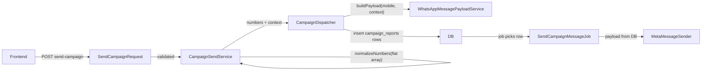

# Excel Campaign Mode — Backend Changes

## Branch Strategy

```
main (current, stable) → feature/excel-campaign-mode (all changes here)
```

Create `feature/excel-campaign-mode` from `main`. All changes go there. If anything breaks, `main` remains untouched for rollback.

---

## Pipeline Trace (What Happens Today)



**Key insight**: `body_values` is currently uniform — the same values for every recipient. The per-recipient payload is built in `CampaignDispatcher::buildPayload()` and stored as JSON in the `campaign_reports.payload` column. `SendCampaignMessageJob` reads it from DB and sends it as-is. So per-row Excel values only need to reach the payload-build step.

---

## Exact Files That Need Changes (3 files)

### 1. [app/Http/Requests/Messaging/SendCampaignRequest.php](app/Http/Requests/Messaging/SendCampaignRequest.php) — Validation

**What changes**: Add 2 new fields, make `numbers.*` validation conditional.

- Add `campaign_source` — `nullable|string|in:manual,excel` (defaults to `manual`)
- Add `excel_data` — `nullable|array`
- When `campaign_source === 'excel'`: validate `numbers.*.number` (required|string) and `numbers.*.value` (required|array)
- When `campaign_source === 'manual'` (or absent): keep existing `numbers.*` as `required|string`

### 2. [app/Services/Messaging/CampaignSendService.php](app/Services/Messaging/CampaignSendService.php) — Orchestration

**What changes**: Handle the two shapes of `numbers`, pass per-row values downstream.

- `execute()`: Read `campaign_source` from validated data (default `'manual'`)
- When Excel mode:
  - Extract flat phone numbers from `numbers[].number` for normalization/counting/validation
  - Build a `number => values` lookup map for per-row substitution
  - Pass this map into dispatch context as `row_values_map`
- `normalizeNumbers()`: No change needed (it will receive a flat array either way — we extract before calling it)
- `buildDispatchContext()`: Add `campaign_source` and `row_values_map` to the context array

**Critical lines** in [CampaignSendService.php](app/Services/Messaging/CampaignSendService.php):

```41:41:app/Services/Messaging/CampaignSendService.php
        $numbers = $this->normalizeNumbers($validated['numbers']);
```

This line needs branching: if Excel mode, extract `number` fields first, then normalize.

```117:117:app/Services/Messaging/CampaignSendService.php
        $this->campaignDispatcher->start($campaign, $numbers, (string) $config->whatsapp_phone_id, $context);
```

The `$context` passed here will carry `row_values_map` so the dispatcher can use per-row values.

### 3. [app/Services/Campaign/CampaignDispatcher.php](app/Services/Campaign/CampaignDispatcher.php) — Payload Building

**What changes**: Use per-row body values when available.

- `buildPayload()`: Check if `$context['campaign_source'] === 'excel'` and `$context['row_values_map'][$mobile]` exists. If so, use that row's values as `$bodyValues` instead of the uniform `$context['body_values']`.

**Critical lines** in [CampaignDispatcher.php](app/Services/Campaign/CampaignDispatcher.php):

```119:119:app/Services/Campaign/CampaignDispatcher.php
        $bodyValues = is_array($context['body_values'] ?? null) ? array_values($context['body_values']) : [];
```

This line becomes: if `campaign_source === 'excel'`, look up `row_values_map[$mobile]` instead.

---

## Files That Do NOT Need Changes (7 files)

| File | Why no change needed |
|---|---|
| `MessagingController.php` | Just passes `$validated` to service — pass-through |
| `WhatsAppMessagePayloadService.php` | Already accepts `$dynamicValues` param — works for both modes |
| `SendCampaignMessageJob.php` | Reads pre-built payload from DB — mode-agnostic |
| `CampaignFeederJob.php` | Dispatches jobs from DB — mode-agnostic |
| `MetaMessageSender.php` | Sends raw payload to Meta API — mode-agnostic |
| `CampaignController.php` | Campaign listing/reporting — unrelated to send flow |
| Database/Migrations | No new columns needed — payload is already JSON |

---

## Implementation Logic (Pseudocode)

### In CampaignSendService::execute()

```php
$campaignSource = $validated['campaign_source'] ?? 'manual';
$rowValuesMap = [];

if ($campaignSource === 'excel') {
    $rawNumbers = array_map(fn($row) => (string) $row['number'], $validated['numbers']);
    // Build lookup: normalized_number => value[]
    foreach ($validated['numbers'] as $row) {
        $normalized = preg_replace('/\D/', '', (string) $row['number']);
        $rowValuesMap[$normalized] = $row['value'] ?? [];
    }
} else {
    $rawNumbers = $validated['numbers'];
}

$numbers = $this->normalizeNumbers($rawNumbers);
```

### In CampaignDispatcher::buildPayload()

```php
$bodyValues = [];
if (($context['campaign_source'] ?? 'manual') === 'excel') {
    $bodyValues = $context['row_values_map'][$mobile] ?? [];
} else {
    $bodyValues = is_array($context['body_values'] ?? null) ? array_values($context['body_values']) : [];
}
```

---

## Risk Assessment

- **Low risk**: Only 3 files touched, all in the send flow
- **Zero risk to manual mode**: The `campaign_source` defaults to `'manual'`, so all existing behavior is preserved when the field is absent
- **Rollback**: Switch back to `main` branch instantly
- **No DB migration needed**: The per-row values go into the existing `payload` JSON column

