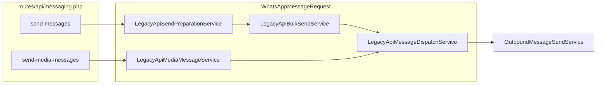

# Legacy API refactor — file count and status

## Current controller state

[`app/Http/Controllers/Messaging/WhatsAppMessageRequest.php`](app/Http/Controllers/Messaging/WhatsAppMessageRequest.php) is already thin (~99 lines vs **~1,054** on `HEAD`). It only:

- Injects three services
- Delegates `sendMessages` → `prepare` + `sendAll` + `LegacyApiBulkSendResource`
- Delegates `sendMediaMessage` → `LegacyApiMediaMessageService`
- Keeps **private** error mappers (`validationErrorResponse`, `legacyErrorResponse`) — ~37 lines

## How many files needed this change?

### Direct refactor footprint: **18 files**

| Role | Count | Paths |
|------|------:|-------|
| **Services** (new) | 8 | [`app/Services/Messaging/LegacyApi/`](app/Services/Messaging/LegacyApi/) — preparation, bulk send, media message, dispatch, payload builder, template, media upload, report side effects |
| **DTOs** (new) | 2 | [`LegacyApiSendContext.php`](app/Data/Messaging/LegacyApiSendContext.php), [`LegacyApiBulkSendResult.php`](app/Data/Messaging/LegacyApiBulkSendResult.php) |
| **Form requests** (new) | 2 | [`SendWhatsAppApiMessageRequest.php`](app/Http/Requests/Messaging/SendWhatsAppApiMessageRequest.php), [`SendWhatsAppMediaMessageRequest.php`](app/Http/Requests/Messaging/SendWhatsAppMediaMessageRequest.php) |
| **Trait** (new) | 1 | [`ResolvesApiKeyTenant.php`](app/Traits/ResolvesApiKeyTenant.php) — API key, IP auth (`ip_auth === '1'`), tenant user, WhatsApp config |
| **Resources** (new) | 2 | [`LegacyApiBulkSendResource.php`](app/Http/Resources/Messaging/LegacyApiBulkSendResource.php), [`LegacyApiErrorResource.php`](app/Http/Resources/Messaging/LegacyApiErrorResource.php) |
| **Exception** (new) | 1 | [`LegacyApiValidationException.php`](app/Exceptions/Messaging/LegacyApiValidationException.php) |
| **Controller** (modified) | 1 | [`WhatsAppMessageRequest.php`](app/Http/Controllers/Messaging/WhatsAppMessageRequest.php) — **−1,015 lines** in working tree |
| **Controller** (removed) | 1 | `SendMessageByObject.php` (deleted; was ~120 lines) |

**Net:** 16 new artifacts + 1 rewritten controller + 1 deletion = **18 file operations** for this feature.

### Not part of the 18 (reused as-is)

- [`OutboundMessageSendService`](app/Services/Messaging/OutboundMessageSendService.php) — billing + Meta send (used by `LegacyApiMessageDispatchService`)
- [`CampaignPricingService`](app/Services/Billing/CampaignPricingService.php) — bulk credit estimate in preparation
- [`routes/api/messaging.php`](routes/api/messaging.php) — unchanged; still points at the same controller methods

### Out of scope for this legacy-API count

Git also shows unrelated messaging work (e.g. `OnboardingController`, `SendCampaignRequest` changes) — **not** counted above.

---

## Layer responsibilities (already in place)

| Layer | Responsibility |
|-------|----------------|
| **Form requests** | HTTP rules + allow-list param validation (`ALLOWED_PARAMS`) |
| **`ResolvesApiKeyTenant`** | `resolveActiveApiKey`, `assertApiKeyIpAllowed`, `assertWhatsAppConfigured` |
| **`LegacyApiSendPreparationService`** | Auth, credits, template resolve/upload, `LegacyApiSendContext` for bulk route |
| **`LegacyApiBulkSendService`** | Per-recipient loop + `LegacyApiBulkSendResult` |
| **`LegacyApiMediaMessageService`** | Document upload + single send (duplicates some auth instead of calling `prepare()`) |
| **`LegacyApiMessageDispatchService`** | Payload + `OutboundMessageSendService` + side effects |
| **Resources** | Bulk success + generic errors; media success still inline in controller |

---

## Remaining polish (optional, **not** required for “done”)

If the goal is a **fully** slim controller with zero private helpers and symmetric resources:

| Change | Extra files |
|--------|------------|
| `LegacyApiMediaSuccessResource` (replace inline JSON in `sendMediaMessage`) | **+1** new |
| `LegacyApiResponseFactory` or exception handler (move `validationErrorResponse` / `legacyErrorResponse` + VAL005 special case) | **+1** new, **1** controller edit |
| Reuse preparation for media auth (extract `prepareMediaContext()` or shared `authenticateRequest()`) | **0–1** new, **2** service edits |

**Optional polish total: 2–4 more files**, mostly **edits** to existing services/controller.

---

## Answer summary

- **Files that needed this change:** **18** (16 new + 1 controller rewrite + 1 controller removal).
- **Controller slimming:** Already done; bulk path uses resources end-to-end; media path and error mapping are the only notable leftovers.
- **No further file explosion** unless you add the optional response factory / media resource (~2–4 files).
