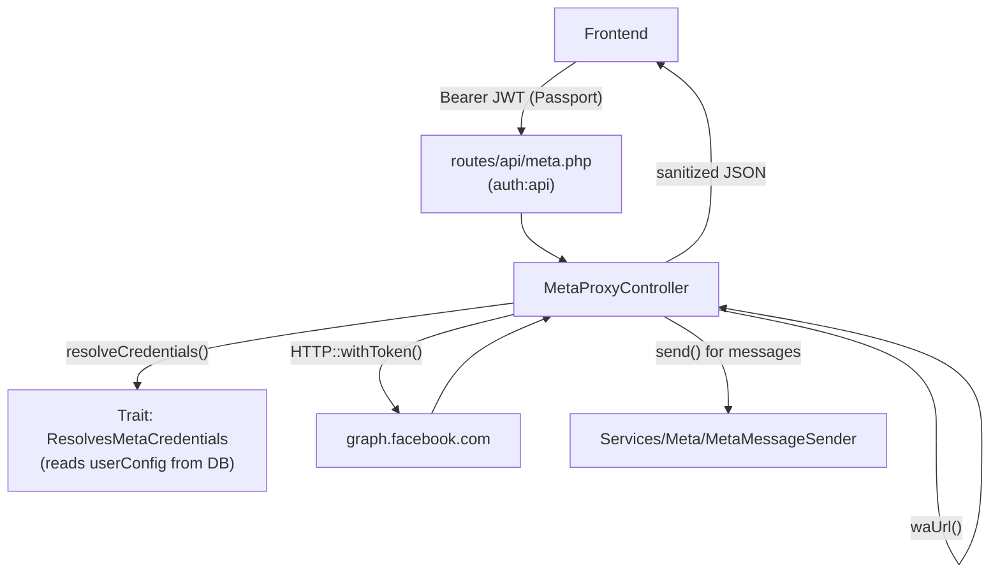

# Meta Proxy API — Implementation Plan

## Flow



## New Files

### 1. `app/Traits/ResolvesMetaCredentials.php`
- `resolveCredentials()` — loads `auth()->user()->userConfig`, aborts 403 if missing, returns `[phone_id, waba_id, token]`
- `waUrl(string $envKey, array $replacements)` — reads env template, does `str_replace(array_keys, array_values)` — single place for all URL building
- `metaHeaders()` — returns `Authorization: Bearer {token}` + `Accept: application/json` headers

### 2. `app/Http/Controllers/Meta/MetaProxyController.php`
Uses `ResolvesMetaCredentials` trait. Uses Laravel's `Http` facade (not Guzzle directly).

**Phase 1 methods (critical):**
- `send(Request $request)` — validates `to` required, resolves creds, delegates to `MetaMessageSender::send()`, returns `{ok, wamid, error}`
- `getTemplates()` — GET `WA_API_TEMPLATES`
- `createTemplate(Request $request)` — POST `WA_API_TEMPLATE_SUBMIT`
- `deleteTemplate(Request $request, string $name)` — DELETE `WA_API_TEMPLATE_DELETE` with `?hsm_id=`
- `connect(Request $request)` — OAuth code exchange using `META_APP_ID` + `META_APP_SECRET` from env only; returns `{access_token}` to frontend

**Phase 2 methods:**
- `uploadMedia(Request $request)` — multipart POST to `WA_API_MEDIA`
- `getMedia(string $mediaId)` — GET `WA_API_MEDIA_DOWNLOAD`
- `getFlows()` — GET `WA_API_FLOWS`
- `createFlow(Request $request)` — POST `WA_API_FLOWS`
- `publishFlow(string $flowId)` — POST `WA_API_FLOW_PUBLISH`
- `deleteFlow(string $flowId)` — DELETE `WA_API_FLOW_DELETE`

**Phase 3 methods:**
- `phoneNumbers()` — GET `WA_API_PHONE_NUMBERS`

**Response sanitization on all methods:** strip `error.fbtrace_id` before returning.

### 3. `routes/api/meta.php`
```
Route::prefix('meta')->middleware(['auth:api'])->group(function () {
    // Phase 1
    Route::post('send', [MetaProxyController::class, 'send'])->middleware('throttle:60,1');
    Route::get('templates', ...);
    Route::post('templates', ...);
    Route::delete('templates/{name}', ...);
    Route::post('connect', ...);

    // Phase 2
    Route::post('media/upload', ...);
    Route::get('media/{mediaId}', ...);
    Route::get('flows', ...);
    Route::post('flows', ...);
    Route::post('flows/{flowId}/publish', ...);
    Route::delete('flows/{flowId}', ...);

    // Phase 3
    Route::get('phone-numbers', ...);
});
```

## .env Additions (to the `# apis` block)
Missing keys to add:
- `META_APP_ID`
- `META_APP_SECRET`
- `WA_API_FLOWS`
- `WA_API_FLOW_PUBLISH`
- `WA_API_FLOW_DELETE`
- `WA_API_TEMPLATE_SUBMIT`
- `WA_API_TEMPLATE_DELETE`
- `WA_API_PHONE_NUMBERS`
- `WA_API_MEDIA_DOWNLOAD`

## `routes/api.php`
Add `require __DIR__.'/api/meta.php';`

## Security rules enforced in controller/trait
- Token ALWAYS from `userConfig->meta_access_token` — never from request
- `connect()` uses `META_APP_SECRET` from env — never returned in any response
- `fbtrace_id` stripped from all Meta error responses
- `send` throttled at 60/min per user

## What does NOT change
- `MetaMessageSender` — reused as-is for `send()` (has dry_run, retryable logic already)
- Existing `send-messages`, `send-campaign` routes — untouched
- `DashboardController::weeklyReport` analytics — already proxied correctly
