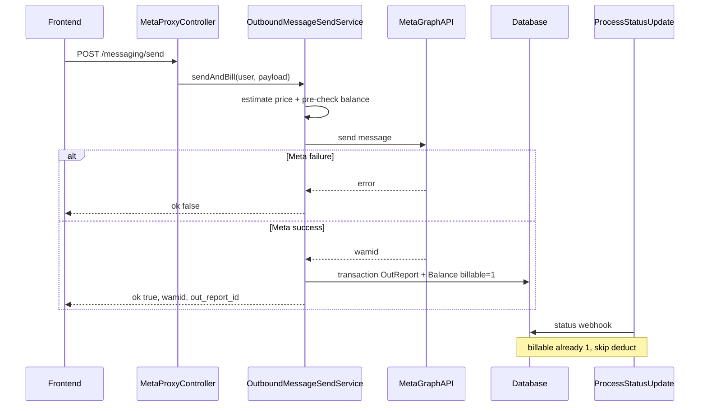

# Meta proxy single-send billing + balance archive

## Goals

1. **`MetaProxyController::send`** — after Meta accepts a message, persist **one `OutReport`** and **one `Balance`** row per message (not campaign-style bulk debit).
2. **No double billing** — webhook path ([`ProcessStatusUpdate`](app/Jobs/ProcessStatusUpdate.php), [`NodeHelper::deduct`](app/Http/Controllers/Notification/NodeHelper.php)) must skip messages already marked `billable = 1`.
3. **Balance archive** — implement [`.cursor/plans/BALANCE_ARCHIVE_IMPLEMENTATION.md`](.cursor/plans/BALANCE_ARCHIVE_IMPLEMENTATION.md) (migration, config, command, schedule, admin history union).

---

## Billing design (proposed)

### When to charge

| Step | Action |
|------|--------|
| 1 | Resolve authenticated `User` + pricing (same as campaigns). |
| 2 | Compute **unit price** from message payload. |
| 3 | **Pre-check** balance (fail fast `422` if insufficient — same UX as `CampaignSendService`). |
| 4 | Call [`MetaMessageSender::send`](app/Services/Meta/MetaMessageSender.php). |
| 5 | **Only on Meta success** (`ok` + `wamid`): DB transaction with `lockForUpdate` on latest balance → create `OutReport` → create `Balance` → set `billable = 1`. |
| 6 | Meta failure → no `OutReport`, no `Balance` (user not charged). |

This avoids charging failed API calls and matches “pay when send succeeds,” unlike campaigns (upfront bulk).

### Unit price resolution

Reuse [`CampaignPricingService`](app/Services/Billing/CampaignPricingService.php):

| Payload `type` | Price rule |
|----------------|------------|
| `template` | `unitPriceForTemplateCategory($pricing, $category)` |
| `text` / other | `marketing_price` (same as custom campaign sends) |

**Category for templates** (priority order):

1. Optional request field `billing_category` (`marketing|utility|authentication|service`) — validated, documented in [`docs/META_MESSAGING_PROXY_API.md`](docs/META_MESSAGING_PROXY_API.md).
2. Else resolve template name via Meta templates API — extend [`WhatsAppTemplateResolver`](app/Services/Messaging/WhatsAppTemplateResolver.php) to return `category` from Meta (`MARKETING` → `marketing`, etc.).
3. If category unknown → default `marketing` (existing service default).

### OutReport shape (minimal, consistent with [`WhatsAppMessageRequest::MakeOutReport`](app/Http/Controllers/Messaging/WhatsAppMessageRequest.php))

| Field | Value |
|-------|--------|
| `user_id` | `auth()->id()` |
| `display_phone_number` | `$user->whatsapp_number` |
| `phone_number_id` | resolved `phone_id` |
| `status_id` | Meta `wamid` |
| `recipient_id` | normalized `to` |
| `status` | `sent` |
| `billable` | `1` (string column — blocks webhook re-bill) |
| `category` | resolved billing category |
| `messaging_product` | `whatsapp` |

Optional follow-up (not blocking): `ApiTemplateReport` row when `type === template` (parity with legacy single-send UI).

### Balance row (per message)

Mirror campaign debit style in [`CampaignSendService::persistCampaignWithDeduction`](app/Services/Messaging/CampaignSendService.php):

- `new_credit` = unit price  
- `total_credits` = previous − price  
- `report_id` = `out_reports.id` (**important for archive + audit trail**)  
- `auto_deduction` = `'true'`  
- `payment_type` = latest balance’s `payment_type` or `'cash'`  
- `remarks` = `Message debit wamid:<wamid>`  
- `account_manager_id` = `reporting_user` when set  

### Idempotency

Before send (or inside post-success transaction): if `out_reports.status_id = wamid` already exists for this user → return `409` / skip second deduction. Prevents duplicate charges on client retries.

### Double-billing guard

[`ProcessStatusUpdate::updateOutReportOptimized`](app/Jobs/ProcessStatusUpdate.php) only bills when `$outReport->billable != 1`. Creating the report with `billable = 1` at send time ensures webhooks **update status only**, no second `balances` insert.



---

## New code structure

| File | Responsibility |
|------|----------------|
| [`app/Services/Messaging/OutboundMessageSendService.php`](app/Services/Messaging/OutboundMessageSendService.php) | Orchestrate pre-check → Meta send → post-success billing transaction |
| [`app/Services/Billing/MessagePricingResolver.php`](app/Services/Billing/MessagePricingResolver.php) | Map Meta payload → unit price + category (wraps `CampaignPricingService`) |
| [`app/Models/Billing/BalancesArchive.php`](app/Models/Billing/BalancesArchive.php) | Eloquent model for archive table (optional but clean for union queries) |
| [`app/Console/Commands/Billing/ArchiveBalancesCommand.php`](app/Console/Commands/Billing/ArchiveBalancesCommand.php) | `balances:archive` per spec |
| [`config/billing.php`](config/billing.php) | `archive.retention_days`, `archive.batch_size` |

[`MetaProxyController::send`](app/Http/Controllers/Meta/MetaProxyController.php) becomes a thin delegate (~15 lines): validate `to`, call service, map domain exceptions to JSON.

### Success response (additive, backward compatible)

```json
{
  "ok": true,
  "wamid": "wamid....",
  "out_report_id": 12345,
  "deducted": 0.85,
  "balance_after": 99.15
}
```

### Error responses

| Case | HTTP |
|------|------|
| Insufficient credits | `422` `{ "ok": false, "error": "...", "code": "INSUFFICIENT_CREDITS" }` |
| Pricing missing | `422` `PRICING_NOT_CONFIGURED` |
| Duplicate wamid | `409` `ALREADY_BILLED` |

---

## Part 2: Balance archive ([spec](.cursor/plans/BALANCE_ARCHIVE_IMPLEMENTATION.md))

### Migration

- `database/migrations/2026_05_19_*_create_balances_archive_table.php`
- Copy all `balances` columns + `original_id` (unique) + `archived_at`
- Add indexes on `balances`: `(user_id, id DESC)`, `(created_at)` if missing
- Archive indexes: `UNIQUE(original_id)`, `(user_id, created_at)`

### Config + command

- [`config/billing.php`](config/billing.php) with env `BALANCE_ARCHIVE_RETENTION_DAYS` (90), `BALANCE_ARCHIVE_BATCH_SIZE` (5000)
- `balances:archive --dry-run --batch=N` — eligible rows: older than retention **and** not `MAX(id)` per `user_id`; batch insert to archive + delete from hot table in one transaction

### Schedule

[`app/Console/Kernel.php`](app/Console/Kernel.php):

```php
$schedule->command('balances:archive')->dailyAt('02:00')->withoutOverlapping();
```

### BalanceController admin history

[`BalanceController::index`](app/Http/Controllers/Billing/BalanceController.php) — replace `Balance::...->get()` for admin `allHistory` with **paginated union** of hot + archive (e.g. `UNION ALL` subquery or two queries merged by `created_at`), capped page size (e.g. 50). **Do not change** per-user `latest_balance` / `history` (still reads latest hot row only).

Invalidate cache keys when archive runs or on balance writes.

---

## Files to touch

| File | Change |
|------|--------|
| [`MetaProxyController.php`](app/Http/Controllers/Meta/MetaProxyController.php) | Delegate to `OutboundMessageSendService` |
| [`WhatsAppTemplateResolver.php`](app/Services/Messaging/WhatsAppTemplateResolver.php) | Return `category` from Meta template object |
| [`docs/META_MESSAGING_PROXY_API.md`](docs/META_MESSAGING_PROXY_API.md) | Document billing fields + new response fields |
| [`BalanceController.php`](app/Http/Controllers/Billing/BalanceController.php) | Paginated hot+archive `allHistory` |
| [`Kernel.php`](app/Console/Kernel.php) | Schedule archive command |
| `.env.example` | Archive env vars (if present) |

---

## Out of scope (explicit)

- Refunding failed deliveries after send-time debit
- ChatHistory / ApiTemplateReport (can add in a small follow-up)
- Changing campaign upfront billing
- Deprecating `NodeHelper::deduct` (still needed for legacy Node paths)

---

## Verification checklist

- Send template via proxy with sufficient balance → 1 `out_reports` + 1 `balances` with linked `report_id`, `billable=1`
- Insufficient balance → `422` before Meta call
- Meta error → no DB rows
- Webhook `delivered` for same `wamid` → status updates, **no** second balance row
- `balances:archive --dry-run` counts eligible rows; live run preserves latest row per user
- Admin balance history returns paginated hot+archive union
