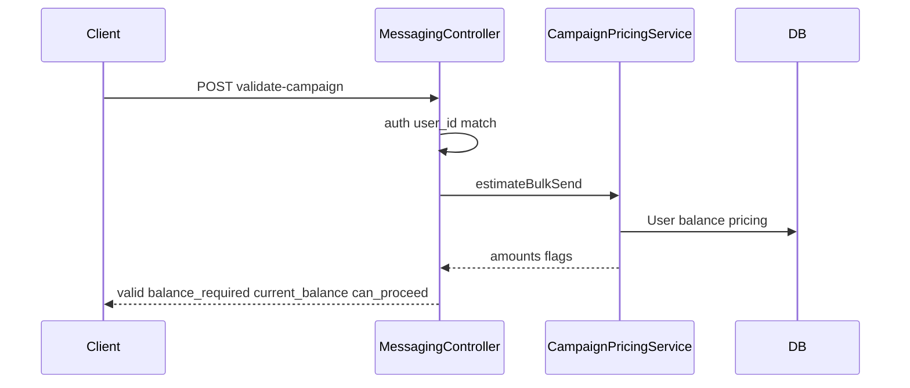

# Validate-campaign API and shared pricing service

## Contract (from your spec)

**Request body:** `user_id`, `campaign_type` (`template` | `Custom`), `template_name` (template mode), `custom_text` (custom mode), `numbers_count`, `template_category`.

**Success-style response (HTTP 200):** `{ valid: true|false, balance_required: number, current_balance: number, can_proceed: boolean }` plus an optional `message` (or `errors`) when `valid` is false so the client can show why.

**Security:** The route already uses [`auth:api`](routes/api/messaging.php). Reject with **403** (or `valid: false` with a clear message—prefer **403** for IDOR) if `user_id` ≠ `auth()->id()`.

## Existing logic to reuse (not duplicate)

| Location | What it does |
|----------|----------------|
| [`UserController::getPriceByCategory`](app/Http/Controllers/User/UserController.php) (private, ~944–958) | Maps `template_category` → `marketing_price` / `utility_price` / `authentication_price` / `service_price` (default marketing). **Only used inside** `UserController` (campaign cost aggregation ~905). |
| [`UserController::CheckValidUser`](app/Http/Controllers/User/UserController.php) (~205–229) | Loads user + latest balance + pricing; checks **single** `marketing_price` vs balance. Different shape than your new API; optional thin reuse later. |
| [`WhatsAppMessageRequest::validateMessageRequest`](app/Http/Controllers/Messaging/WhatsAppMessageRequest.php) | API-key flow, credits, template/custom rules—**not** suitable to call directly from Passport-authenticated bulk validate (different auth and response shape). |

There is **no** existing endpoint that returns `balance_required` × `numbers_count`. The new behavior belongs in a **small service** that both `MessagingController` and `UserController` can use for **category → unit price**.

## Pricing rules (aligned with current app)

- **Template mode** (`campaign_type` normalized to `template`): unit price = `getPriceByCategory` logic using `template_category` (same switch as today in `UserController`).
- **Custom mode** (`Custom` / `custom`): treat each recipient like a marketing-priced outbound for estimation—use **`marketing_price`** per message (same mental model as `CheckValidUser` and `SendMessageByObject` single-message checks). Document in a one-line comment if Meta billing differs later.

**Formula:** `balance_required = round(unit_price * numbers_count, 2)` (or integer if credits are always integers—match how `total_credits` is stored in [`Balance`](app/Models/Billing/Balance.php) / existing JSON).

**`can_proceed`:** `current_balance >= balance_required` (and payload/business rules satisfied).

**`valid`:** `true` when inputs are valid **and** `can_proceed` is `true`; otherwise `false` with a human-readable `message` (and optionally `errors` for 422-style field errors if you validate in a FormRequest).

## Implementation steps

### 1. New service: category pricing + campaign estimate

Add e.g. [`app/Services/Billing/CampaignPricingService.php`](app/Services/Billing/CampaignPricingService.php) (name can be `CampaignCreditValidationService` if you prefer) with:

- `unitPriceForTemplateCategory(PricingModel $pricing, ?string $templateCategory): float` — **move** the switch from `UserController::getPriceByCategory` here (same cases, `strtolower` on category).
- `unitPriceForBulkCampaign(string $campaignType, ?string $templateCategory, PricingModel $pricing): float` — delegates to template-category logic for `template`; returns `marketing_price` for custom.
- `estimateBulkSend(int $userId, int $numbersCount, string $campaignType, ?string $templateCategory): array` — loads `User` with `latestBalance` + `pricingModel` (mirror patterns in `CheckValidUser`), returns `current_balance`, `balance_required`, `can_proceed`, and flags for missing user/pricing.

Keep the service **free of HTTP**; return a plain array or small value object so the controller maps to JSON.

### 2. Refactor `UserController` only where DRY matters

In the method that calls `$this->getPriceByCategory` (~905), inject `CampaignPricingService` (constructor DI) and replace the private method with `$this->campaignPricingService->unitPriceForTemplateCategory(...)`.

**Remove** the private `getPriceByCategory` from `UserController` after the service exists.

*(Optional follow-up, not required for your endpoint: refactor `CheckValidUser` to use the same service’s `unitPriceForTemplateCategory(..., 'marketing')` for the single-message check—keeps one source of truth for “default marketing price”.)*

### 3. [`MessagingController::validateCampaign`](app/Http/Controllers/Messaging/MessagingController.php)

- Validate input with `$request->validate([...])` or a dedicated `FormRequest`:
  - `user_id`: `required|integer`
  - `campaign_type`: `required|string` + normalize with `strtolower` / accept `Custom` and `template`
  - `numbers_count`: `required|integer|min:1` (add a sane `max` if you want abuse protection, e.g. 100000)
  - `template_name`: `required_if:campaign_type,template,...|nullable|string` (include case variants if the client sends `Template`)
  - `custom_text`: `required_if` for custom modes | `nullable|string`
  - `template_category`: required for template mode (nullable only if you allow default); recommend **required when campaign_type is template**
- Enforce `user_id === auth()->id()`.
- Call `CampaignPricingService::estimateBulkSend(...)` (plus pass `template_name` / `custom_text` only if you add non-balance checks: e.g. non-empty string already covered by validation).
- Return **200** + JSON payload in all “business outcome” cases (`valid` / `can_proceed`); use **422** only if you prefer strict Laravel validation errors for malformed bodies (either is fine—pick one and stay consistent).

### 4. Out of scope (unless you ask)

- Meta template existence / name verification (would need WABA API or DB sync).
- `send-campaign` implementation.

## Flow

## Files to touch

| File | Change |
|------|--------|
| New: `app/Services/Billing/CampaignPricingService.php` | Unit price + bulk estimate |
| [`app/Http/Controllers/User/UserController.php`](app/Http/Controllers/User/UserController.php) | DI service; replace `getPriceByCategory` usage; delete private method |
| [`app/Http/Controllers/Messaging/MessagingController.php`](app/Http/Controllers/Messaging/MessagingController.php) | Real `validateCampaign` implementation |
| Optional: `app/Http/Requests/Messaging/ValidateCampaignRequest.php` | Cleaner validation |

No route changes required.
