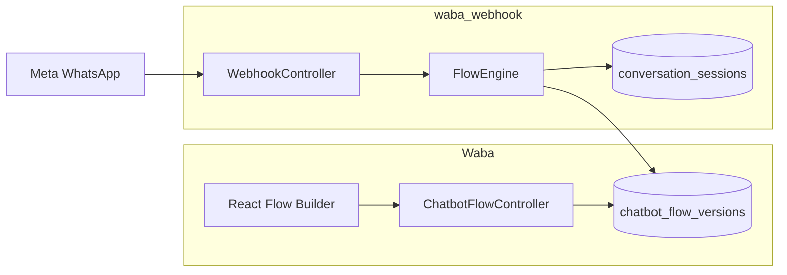

# Chatbot v2 — Waba implementation guide

**Repo:** `/Applications/XAMPP/xamppfiles/htdocs/Waba`  
**Runtime (WhatsApp webhook):** `/Applications/XAMPP/xamppfiles/htdocs/waba_webhook`  
**Frontend:** Separate React app (Ant Design + `@xyflow/react`) — not in this repo.

Use this document as the single checklist for **what to build in Waba first** (DB, API, services) before the flow-builder UI and before wiring the v2 engine in `waba_webhook`.

**Related docs (waba_webhook / shared):**

- Architecture audit: `waba_webhook/.cursor/plans/chatbot_architecture_audit_80aee82d.plan.md`
- UI + antd: `waba_webhook/docs/product-commerce-flow-ui-antd.md`
- AI mockup prompts: `waba_webhook/docs/flow-builder-ui-ai-prompts.md`
- Project overview: [WABA_PROJECT.md](WABA_PROJECT.md)

---

## 1. What lives where

| Responsibility | Project | Notes |
|----------------|---------|--------|
| Migrations `chatbot_flow_versions`, `conversation_sessions` | **Waba** | Shared PostgreSQL DB |
| Admin API: CRUD flows, publish, duplicate, test simulate | **Waba** | New controller — do not overload legacy `ChatBotController` |
| Flow builder React UI | **Frontend** | Calls Waba APIs with `auth:api` |
| Run flow on inbound WhatsApp message | **waba_webhook** | `FlowEngine`, `ProcessInboundMessageJob`, feature flag |
| Legacy chatbot CRUD | **Waba** | Keep `routes/api/chat.php` until tenants migrate |



---

## 2. Recommended build order

Do **not** start with the React canvas alone. Minimum path:

| Phase | Work | Owner |
|-------|------|--------|
| **0** | Freeze JSON schema (`nodes`, `edges`, `vars`) | Both repos — see §4 |
| **1** | Migrations + Eloquent models | Waba |
| **2** | `ChatbotFlowController` + routes + Form Requests | Waba |
| **3** | `ChatbotFlowService` (save, publish, validate definition) | Waba |
| **4** | React: list flows → editor → save draft → publish | Frontend |
| **5** | `FlowEngine` + session repo in `waba_webhook` | waba_webhook |
| **6** | Feature flag per tenant `chatbot.engine` = `legacy` \| `v2` | Both |
| **7** | Migration script: old `chatbots` rows → flow JSON | Waba (command) |

---

## 3. Database

### 3.1 New tables

**File:** `database/migrations/2026_05_21_000001_create_chatbot_flow_versions_table.php`

```sql
chatbot_flow_versions (
  id                BIGSERIAL PRIMARY KEY,
  user_id           BIGINT NOT NULL REFERENCES users(id),
  group_id          BIGINT NULL REFERENCES chatbot_groups(id),
  name              VARCHAR(255) NOT NULL,
  slug              VARCHAR(255) NULL,
  version           INTEGER NOT NULL DEFAULT 1,
  status            VARCHAR(20) NOT NULL DEFAULT 'draft',  -- draft | published | archived
  definition        JSONB NOT NULL,                        -- nodes[] + edges[] + meta
  is_active         BOOLEAN NOT NULL DEFAULT false,        -- one active published per group optional
  published_at      TIMESTAMP NULL,
  published_by      BIGINT NULL,
  legacy_group_id   BIGINT NULL,                           -- migration helper
  created_at        TIMESTAMP,
  updated_at        TIMESTAMP,
  deleted_at        TIMESTAMP NULL
);

-- Indexes
CREATE INDEX chatbot_flow_versions_user_id_idx ON chatbot_flow_versions(user_id);
CREATE INDEX chatbot_flow_versions_group_status_idx ON chatbot_flow_versions(user_id, group_id, status);
CREATE UNIQUE INDEX chatbot_flow_versions_active_group
  ON chatbot_flow_versions(user_id, group_id)
  WHERE is_active = true AND deleted_at IS NULL;
```

**File:** `database/migrations/2026_05_21_000002_create_conversation_sessions_table.php`

```sql
conversation_sessions (
  id                  BIGSERIAL PRIMARY KEY,
  user_id             BIGINT NOT NULL,
  wa_id               VARCHAR(32) NOT NULL,              -- customer WhatsApp id
  display_phone_number VARCHAR(32) NULL,
  flow_version_id     BIGINT NOT NULL REFERENCES chatbot_flow_versions(id),
  current_node_id     VARCHAR(36) NULL,                  -- UUID string, null = at triggers
  awaiting_input      BOOLEAN NOT NULL DEFAULT false,
  vars                JSONB NOT NULL DEFAULT '{}',       -- cumulative session memory
  meta                JSONB NULL,                        -- last_api, api_cache, report_id, contact
  expires_at          TIMESTAMP NULL,
  created_at          TIMESTAMP,
  updated_at          TIMESTAMP,
  UNIQUE (user_id, wa_id)
);

CREATE INDEX conversation_sessions_flow_version_id_idx ON conversation_sessions(flow_version_id);
CREATE INDEX conversation_sessions_expires_at_idx ON conversation_sessions(expires_at);
```

**Naming:** UI may label this “Variables”; DB column is `vars` (not `slots`, not `WAITING_FOR_*`).

### 3.2 Tables to deprecate (later)

| Legacy | v2 replacement |
|--------|----------------|
| `chatbot_states.state` | `conversation_sessions.current_node_id` + `awaiting_input` |
| `chatbot_memories` | `conversation_sessions.vars` |
| `chatbots` wide row config | `chatbot_flow_versions.definition` nodes |

Keep legacy tables during dual-read; do not drop until all tenants on v2.

### 3.3 Optional later

- `chatbot_flow_version_history` — snapshot on each publish (audit)
- `inbound_messages` / `outbound_messages` — normalize reports (phase C in architecture plan)

---

## 4. Flow definition JSON contract

Stored in `chatbot_flow_versions.definition`. **Source of truth** for UI export and runtime engine.

```json
{
  "flow_id": "commerce-demo",
  "version": 1,
  "entry": { "trigger_evaluation": "first_match" },
  "nodes": [
    {
      "id": "trg-hi",
      "type": "trigger.keyword",
      "config": { "keywords": ["hi", "hello"], "match": "fuzzy" },
      "position": { "x": 0, "y": 0 }
    },
    {
      "id": "ask-otp",
      "type": "logic.ask",
      "config": {
        "prompt_text": "Enter OTP",
        "var": "otp",
        "invalid_reply_text": "Send a numeric OTP"
      }
    },
    {
      "id": "api-verify",
      "type": "integration.api",
      "config": {
        "method": "POST",
        "url": "https://api.example.com/verify?otp={{vars.otp}}&phone={{contact.wa_id}}",
        "use_token": "token",
        "save_from_api": { "token": "data.access_token", "client_id": "data.client_id" }
      }
    },
    {
      "id": "cond-ok",
      "type": "logic.condition",
      "config": { "source": "last_api_response", "path": "success", "operator": "equals", "value": true }
    },
    { "id": "end-1", "type": "flow.end", "config": { "clear_vars": ["otp"] } }
  ],
  "edges": [
    { "from": "trg-hi", "to": "ask-otp", "event": "matched" },
    { "from": "ask-otp", "to": "val-otp", "event": "user_input" },
    { "from": "val-otp", "to": "api-verify", "event": "valid" },
    { "from": "api-verify", "to": "cond-ok", "event": "completed" },
    { "from": "cond-ok", "to": "msg-success", "event": "yes" },
    { "from": "cond-ok", "to": "ask-otp", "event": "no" },
    { "from": "end-1", "to": null, "event": "completed" }
  ]
}
```

### 4.1 Node types (register in engine; document in API validation)

| `type` | Purpose |
|--------|---------|
| `trigger.keyword` | Keyword / fuzzy match when `current_node_id` is null |
| `trigger.default` | New chat with no keyword |
| `trigger.regex` | Regex on inbound text |
| `message.text` | Plain text reply |
| `message.template` | WABA template + buttons |
| `message.interactive_buttons` | Quick reply buttons |
| `message.list_dynamic` | List built from last API JSON |
| `logic.ask` | Prompt; sets `awaiting_input` |
| `logic.validate` | Regex / date_range / custom validator |
| `logic.condition` | Branch on API or `vars` |
| `logic.set_var` | Set `vars.branch` from button payload |
| `logic.route_by_var` | Route edges by `vars.{name}` |
| `integration.api` | HTTP call; `save_from_api`, `use_token` |
| `flow.subflow` | Jump to another `flow_version_id` |
| `flow.end` | Clear session pointer / vars |
| `handoff.agent` | Assign support agent (optional v1.1) |

### 4.2 Edge `event` values

`matched` | `user_input` | `valid` | `invalid` | `completed` | `yes` | `no` | `button_reply` | `route`

Optional `match` on edge: `{ "payload": "buy_product" }`, `{ "branch": "inquiry" }`.

### 4.3 Placeholders (runtime — document for UI tooltips)

| Placeholder | Meaning |
|-------------|---------|
| `{{contact.wa_id}}` | Customer number |
| `{{contact.name}}` | Profile name |
| `{{vars.otp}}` | Session variable |
| `{{api.last.data.token}}` | Last API response path |

**Forbidden in v2:** `WAITING_FOR_*`, `VERIFY_*`, `INITIAL`, `chatbot_action`.

---

## 5. Laravel files to add (Waba)

### 5.1 Directory layout

```text
app/
  Http/
    Controllers/
      Chat/
        ChatBotController.php              # LEGACY — keep unchanged
        ChatbotFlowController.php            # NEW v2
    Requests/
      Chat/
        StoreChatbotFlowRequest.php
        UpdateChatbotFlowRequest.php
        PublishChatbotFlowRequest.php
        SimulateChatbotFlowRequest.php
    Resources/
      Chat/
        ChatbotFlowResource.php
        ChatbotFlowListResource.php
        ConversationSessionResource.php
  Models/
    Chat/
      ChatbotFlowVersion.php                 # NEW
      ConversationSession.php              # NEW
  Services/
    Chat/
      ChatbotFlowService.php
      ChatbotFlowDefinitionValidator.php
      ChatbotFlowPublishService.php
      ChatbotFlowSimulationService.php
  Policies/
    ChatbotFlowPolicy.php
  Traits/
    Chat/
      ResolvesTenantUserId.php               # from auth user / impersonation
      AuthorizesChatbotFlow.php              # user_id scope on models
routes/
  api/
    chatbot_flow.php                         # NEW — require from api.php
config/
  chatbot.php                                # engine default, TTLs (shared keys with webhook)
```

### 5.2 Models

**`App\Models\Chat\ChatbotFlowVersion`**

```php
protected $fillable = [
    'user_id', 'group_id', 'name', 'slug', 'version', 'status',
    'definition', 'is_active', 'published_at', 'published_by',
];
protected $casts = [
    'definition' => 'array',
    'is_active' => 'boolean',
    'published_at' => 'datetime',
];
// relations: user(), group() ChatbotGroup, conversationSessions()
```

**`App\Models\Chat\ConversationSession`**

```php
protected $casts = [
    'vars' => 'array',
    'meta' => 'array',
    'awaiting_input' => 'boolean',
    'expires_at' => 'datetime',
];
// relations: flowVersion()
```

---

## 6. API routes

**New file:** `routes/api/chatbot_flow.php`  
**Register in** `routes/api.php`:

```php
require __DIR__.'/api/chatbot_flow.php';
```

All routes below use middleware: `auth:api` and permission `View Chatbot` (same as legacy), unless noted.

| Method | Path | Controller method | Description |
|--------|------|-------------------|-------------|
| `GET` | `/chatbot-flows` | `index` | List flows for tenant (`user_id` from auth) |
| `POST` | `/chatbot-flows` | `store` | Create draft flow |
| `GET` | `/chatbot-flows/{id}` | `show` | Get flow + full `definition` |
| `PUT` | `/chatbot-flows/{id}` | `update` | Save draft `definition` (no publish) |
| `PATCH` | `/chatbot-flows/{id}` | `patch` | Rename, `group_id`, metadata only |
| `DELETE` | `/chatbot-flows/{id}` | `destroy` | Soft delete draft; block if `is_active` |
| `POST` | `/chatbot-flows/{id}/duplicate` | `duplicate` | Clone to new draft |
| `POST` | `/chatbot-flows/{id}/publish` | `publish` | Validate graph → `status=published`, `version++`, set `is_active` |
| `POST` | `/chatbot-flows/{id}/unpublish` | `unpublish` | `is_active=false` |
| `POST` | `/chatbot-flows/{id}/validate` | `validate` | Dry-run: missing edges, orphan nodes, unknown types |
| `POST` | `/chatbot-flows/{id}/simulate` | `simulate` | Test as customer: body + optional `wa_id` → steps + `vars` |
| `GET` | `/chatbot-flows/{id}/sessions` | `sessions` | Debug: active `conversation_sessions` (paginated) |
| `DELETE` | `/chatbot-flows/sessions/{sessionId}` | `resetSession` | Clear test session |
| `GET` | `/chatbot-flows/groups/{groupId}/active` | `activeForGroup` | Which published flow is active for group |

**Query params for `index`:** `group_id`, `status`, `search`, `page`, `per_page`.

**Legacy routes (unchanged):** `routes/api/chat.php` — `/chatbot-create`, `/chatbot-groups`, etc.

### 6.1 Example route file

```php
<?php

use App\Http\Controllers\Chat\ChatbotFlowController;
use Illuminate\Support\Facades\Route;

Route::middleware(['auth:api', 'check.permission:View Chatbot'])->group(function () {
    Route::get('/chatbot-flows', [ChatbotFlowController::class, 'index']);
    Route::post('/chatbot-flows', [ChatbotFlowController::class, 'store']);
    Route::get('/chatbot-flows/groups/{groupId}/active', [ChatbotFlowController::class, 'activeForGroup']);
    Route::get('/chatbot-flows/{id}', [ChatbotFlowController::class, 'show']);
    Route::put('/chatbot-flows/{id}', [ChatbotFlowController::class, 'update']);
    Route::patch('/chatbot-flows/{id}', [ChatbotFlowController::class, 'patch']);
    Route::delete('/chatbot-flows/{id}', [ChatbotFlowController::class, 'destroy']);
    Route::post('/chatbot-flows/{id}/duplicate', [ChatbotFlowController::class, 'duplicate']);
    Route::post('/chatbot-flows/{id}/publish', [ChatbotFlowController::class, 'publish']);
    Route::post('/chatbot-flows/{id}/unpublish', [ChatbotFlowController::class, 'unpublish']);
    Route::post('/chatbot-flows/{id}/validate', [ChatbotFlowController::class, 'validate']);
    Route::post('/chatbot-flows/{id}/simulate', [ChatbotFlowController::class, 'simulate']);
    Route::get('/chatbot-flows/{id}/sessions', [ChatbotFlowController::class, 'sessions']);
    Route::delete('/chatbot-flows/sessions/{sessionId}', [ChatbotFlowController::class, 'resetSession']);
});
```

---

## 7. Controller — `ChatbotFlowController`

**Namespace:** `App\Http\Controllers\Chat\ChatbotFlowController`

Thin controller: validate request → delegate to services → return API Resources.

| Method | Service call | Response |
|--------|--------------|----------|
| `index` | `ChatbotFlowService::listForUser($userId, $filters)` | `ChatbotFlowListResource::collection` |
| `store` | `ChatbotFlowService::createDraft($dto)` | `201` + `ChatbotFlowResource` |
| `show` | `ChatbotFlowService::findForUser($id, $userId)` | `ChatbotFlowResource` |
| `update` | `ChatbotFlowService::saveDefinition($id, $definition)` | `ChatbotFlowResource` |
| `patch` | `ChatbotFlowService::updateMeta($id, $fields)` | `ChatbotFlowResource` |
| `destroy` | `ChatbotFlowService::deleteDraft($id)` | `{ "status": true }` |
| `duplicate` | `ChatbotFlowService::duplicate($id)` | `201` + new id |
| `publish` | `ChatbotFlowPublishService::publish($id, $note)` | `ChatbotFlowResource` |
| `unpublish` | `ChatbotFlowPublishService::unpublish($id)` | `ChatbotFlowResource` |
| `validate` | `ChatbotFlowDefinitionValidator::validate($definition)` | `{ valid, errors[], warnings[] }` |
| `simulate` | `ChatbotFlowSimulationService::step($id, $message, $waId)` | See §7.1 |
| `sessions` | `ConversationSession::forFlowVersion(...)` | paginated |
| `resetSession` | delete session row | `{ "status": true }` |
| `activeForGroup` | query `is_active` for `group_id` | single flow or null |

Use trait `AuthorizesChatbotFlow` in each method: `abort_unless($flow->user_id === $tenantUserId, 403)`.

### 7.1 Simulate response shape (for “Test as customer” UI)

```json
{
  "status": true,
  "data": {
    "wa_id": "9198XXXXXXXX",
    "flow_version_id": 12,
    "current_node_id": "ask-otp",
    "awaiting_input": true,
    "vars": { "otp": null },
    "outbound_preview": [
      { "type": "text", "body": "Please enter your OTP" }
    ],
    "trace": [
      { "node_id": "trg-hi", "event": "matched" },
      { "node_id": "ask-otp", "event": "completed" }
    ]
  }
}
```

Simulation runs **`ChatbotFlowSimulationService`** in Waba (in-process, no Meta send) until `FlowEngine` is shared via package or duplicated thinly for admin test.

---

## 8. Form requests

| Class | Rules (summary) |
|-------|-----------------|
| `StoreChatbotFlowRequest` | `name` required, `group_id` nullable exists, `definition` nullable array |
| `UpdateChatbotFlowRequest` | `definition` required array; `nodes` min 1; each node `id`, `type`, `config` |
| `PublishChatbotFlowRequest` | optional `note` string; `confirm_breaking` bool if version downgrade blocked |
| `SimulateChatbotFlowRequest` | `message` required string; `wa_id` optional; `reset` bool optional |

---

## 9. API resources

**`ChatbotFlowResource`** — `id`, `name`, `slug`, `group_id`, `version`, `status`, `is_active`, `definition`, `published_at`, `updated_at`.

**`ChatbotFlowListResource`** — omit `definition` on list for payload size; include `node_count`, `trigger_keywords` (derived).

**`ConversationSessionResource`** — for debug panel: `wa_id`, `current_node_id`, `awaiting_input`, `vars`, `meta`, `updated_at` (hide internal ids in UI labels).

---

## 10. Services

### 10.1 `ChatbotFlowService`

- `listForUser(int $userId, array $filters): LengthAwarePaginator`
- `createDraft(CreateFlowDTO $dto): ChatbotFlowVersion` — default empty graph with one `trigger.keyword` node
- `saveDefinition(int $id, array $definition): ChatbotFlowVersion` — only if `status === draft`
- `duplicate(int $id): ChatbotFlowVersion`
- `deleteDraft(int $id): void` — throws if published active

### 10.2 `ChatbotFlowDefinitionValidator`

Returns structured errors for UI Affix bar:

- Orphan nodes (no path from any trigger)
- Nodes with no outgoing edge (except `flow.end`)
- Unknown `type`
- Duplicate node `id`
- Edges pointing to missing `from` / `to`
- `integration.api` missing `url`
- `logic.ask` missing `var` name
- Cycles without exit (warning only)

### 10.3 `ChatbotFlowPublishService`

1. Run validator; abort `422` if errors.
2. Increment `version`.
3. Set `status = published`, `published_at = now()`, `published_by = auth id`.
4. If `group_id` set: deactivate other `is_active` in same `user_id` + `group_id`.
5. Set `is_active = true` on this row.
6. Optional: insert history snapshot row.

### 10.4 `ChatbotFlowSimulationService`

- Load published or draft definition (query param `?use_draft=1`).
- Upsert `conversation_sessions` for test `wa_id` or in-memory DTO.
- Apply one inbound message; return trace + outbound preview (no Graph API).
- Reuse same transition rules as `waba_webhook` engine when available.

---

## 11. Traits

### 11.1 `ResolvesTenantUserId`

```php
// Resolve effective user_id for multi-tenant admin (parent user, sub-account, API context).
protected function tenantUserId(Request $request): int;
```

Mirror pattern from existing controllers that scope by `user_id` on `Chatbot` / `ChatbotGroup`.

### 11.2 `AuthorizesChatbotFlow`

```php
protected function authorizeFlow(ChatbotFlowVersion $flow): void;
protected function authorizeFlowId(int $id): ChatbotFlowVersion;
```

Ensures `flow.user_id === tenantUserId()`.

---

## 12. Policy

**`ChatbotFlowPolicy`**

| Ability | Rule |
|---------|------|
| `viewAny` | permission `View Chatbot` |
| `view` | same user_id |
| `create` | permission `View Chatbot` |
| `update` | owner + draft only for definition |
| `delete` | owner + not active published |
| `publish` | permission `View Chatbot` |

Register in `AuthServiceProvider`.

---

## 13. Config — `config/chatbot.php` (Waba + mirror in waba_webhook)

```php
return [
    'engine' => env('CHATBOT_ENGINE', 'legacy'), // legacy | v2
    'session_ttl_minutes' => (int) env('CHATBOT_SESSION_TTL', 1440),
    'fuzzy_threshold' => (float) env('CHATBOT_FUZZY_THRESHOLD', 0.85),
    'trigger_policy' => env('CHATBOT_TRIGGER_POLICY', 'first_match'), // first_match | best_match
    'queue' => env('CHATBOT_QUEUE', 'default'),
];
```

Per-tenant override later: `userconfigs.chatbot_engine` column (optional migration).

---

## 14. waba_webhook responsibilities (after Waba API exists)

Not implemented in Waba; document for handoff:

| Component | Path (suggested) |
|-----------|------------------|
| `FlowEngine` | `app/Chatbot/Domain/FlowEngine.php` |
| `ConversationSessionRepository` | `app/Chatbot/Infrastructure/ConversationSessionRepository.php` |
| `ProcessInboundMessageJob` | `app/Jobs/ProcessInboundMessageJob.php` |
| `LegacyChatbotBridge` | `app/Chatbot/Infrastructure/Legacy/LegacyChatbotBridge.php` |
| Thin `WebhookController` | dispatch job after dedupe |

**Reads:** active `chatbot_flow_versions` for `user_id` + active `group_id`.  
**Writes:** `conversation_sessions`, `reports` / `out_reports` as today.

---

## 15. Frontend integration (React)

| UI action | API |
|-----------|-----|
| Flow list page | `GET /api/chatbot-flows` |
| Open editor | `GET /api/chatbot-flows/{id}` |
| Save draft | `PUT /api/chatbot-flows/{id}` body `{ definition }` |
| Validate | `POST /api/chatbot-flows/{id}/validate` |
| Test drawer | `POST /api/chatbot-flows/{id}/simulate` |
| Publish modal | `POST /api/chatbot-flows/{id}/publish` |
| Duplicate | `POST /api/chatbot-flows/{id}/duplicate` |

**Auth:** Bearer token from Passport (same as existing chatbot screens).

**Export:** Canvas JSON must match `definition.nodes` + `definition.edges` exactly.

---

## 16. Legacy coexistence

| Concern | Approach |
|---------|----------|
| Active chatbot group | `chatbot_groups.status` still selects group; v2 uses `chatbot_flow_versions.is_active` per group |
| Old editor | Keep until v2 UI ships; link “Open v2 builder” per group |
| Webhook | `config('chatbot.engine')` or per-user flag routes to `LegacyChatbotBridge` vs `FlowEngine` |
| Data migration | Artisan `php artisan chatbot:migrate-legacy-to-flow {userId}` in Waba |

---

## 17. Critical bugs to fix before / during v2 (waba_webhook)

Track in webhook repo; block production quality:

1. `saveValue()` — UPDATE without WHERE on `chatbot_memories`
2. `handleJsonResponse` — missing `break` fallthrough
3. Multi-keyword match — define `first_match` vs `best_match` policy

---

## 18. Testing checklist

### Waba API

- [ ] Create draft flow → `201`
- [ ] Save definition with commerce demo JSON → `200`
- [ ] Validate catches orphan node → `422` with errors
- [ ] Publish sets `is_active`, deactivates sibling in group
- [ ] Cannot delete active published flow
- [ ] `simulate` advances `vars` and `current_node_id`
- [ ] User A cannot access User B flow `403`

### waba_webhook (later)

- [ ] Inbound `hi` matches trigger → template sent
- [ ] Button reply follows `button_reply` edge
- [ ] API node saves `vars.token` via `save_from_api`
- [ ] `flow.end` clears `current_node_id`
- [ ] Legacy tenant still on old switch path

---

## 19. Artisan commands (Waba — optional)

| Command | Purpose |
|---------|---------|
| `chatbot:flow-export {id}` | Dump definition JSON to stdout |
| `chatbot:flow-import {userId} {path}` | Import JSON as draft |
| `chatbot:migrate-legacy-to-flow {userId}` | Build graph from `chatbots` + groups |
| `chatbot:session-prune` | Delete expired `conversation_sessions` |

---

## 20. Permissions & Spatie

Reuse existing permission: **`View Chatbot`**.

Optional later: `Publish Chatbot`, `Delete Chatbot` for stricter RBAC.

---

## 21. Quick reference — files to touch first in Waba

1. `database/migrations/2026_05_21_000001_create_chatbot_flow_versions_table.php`
2. `database/migrations/2026_05_21_000002_create_conversation_sessions_table.php`
3. `app/Models/Chat/ChatbotFlowVersion.php`
4. `app/Models/Chat/ConversationSession.php`
5. `app/Services/Chat/ChatbotFlowService.php`
6. `app/Services/Chat/ChatbotFlowDefinitionValidator.php`
7. `app/Services/Chat/ChatbotFlowPublishService.php`
8. `app/Http/Controllers/Chat/ChatbotFlowController.php`
9. `routes/api/chatbot_flow.php` + require in `routes/api.php`
10. `config/chatbot.php`

Then attach React project and implement list + editor against these endpoints.

---

*Last updated: 2026-05-20 — Chatbot v2 Waba implementation spec.*
