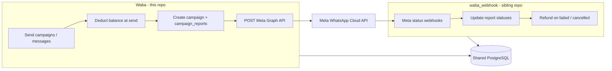
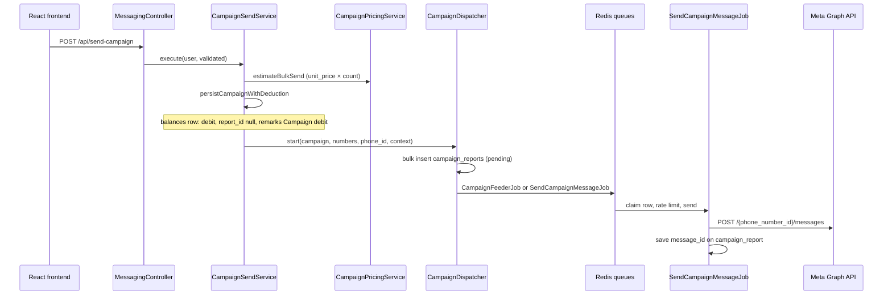

# Waba — Project reference (for developers & AI context)

**Path:** `/Applications/XAMPP/xamppfiles/htdocs/Waba`  
**Role:** Main WhatsApp Business API (WABA) backend — campaigns, messaging, billing, Meta onboarding, chat.  
**Typical URL:** `https://waba.smsforyou.biz`  
**Frontend:** Separate React app (`https://web.smsforyou.biz`) — not in this repo.

> Use this document when working on Waba so you do not need to re-explain the system each time.  
> For **inbound webhooks / status refunds**, see sibling app **`waba_webhook`** (`/Applications/XAMPP/xamppfiles/htdocs/waba_webhook`).

---

## What Waba does

| Area | Description |
|------|-------------|
| **Campaigns** | Bulk template/custom WhatsApp sends; upfront balance debit; queued Meta API sends |
| **Messaging** | API-key and authenticated sends (`send-messages`, Meta proxy) |
| **Meta onboarding** | Embedded signup: token → WABA → phone → register → webhook subscription |
| **Chat / chatbots** | Inbox, flows, support agents, idle timers |
| **Billing** | Append-only `balances` ledger, per-user `pricing_models`, plans, admin refunds — see [Balance archive implementation brief](BALANCE_ARCHIVE_IMPLEMENTATION.md) for AI agents |
| **Reports** | Incoming `reports`, outgoing `out_reports`, per-recipient `campaign_reports` |
| **Realtime** | Laravel Reverb — campaign progress events to React |

**Auth:** API-first — Laravel Passport (`auth:api`) + Spatie permissions. Public sends use API keys.

---

## Tech stack

| Layer | Choice |
|-------|--------|
| PHP | 8.3+ |
| Framework | Laravel 13 |
| DB | **PostgreSQL** (single connection; no multi-driver SQL in new code) |
| Queue / cache | Redis |
| Auth | Passport, Spatie Permission |
| HTTP to Meta | Guzzle (`MetaGraphClient`) |
| Realtime | Laravel Reverb |
| Other | Firebase, Google API client, Maatwebsite Excel |

---

## Split architecture: Waba vs `waba_webhook`



| Responsibility | App |
|----------------|-----|
| Send messages, create campaigns, **debit balance at send** | **Waba** |
| Receive status webhooks, update `campaign_reports` / `out_reports`, **refund failed messages** | **waba_webhook** |
| Shared tables | `users`, `balances`, `campaigns`, `campaign_reports`, `out_reports`, `pricing_models`, … |

**Billing model (current intent):**

1. **Send time (Waba):** One debit per campaign — `recipients × unit price`, `report_id = null`, `remarks = Campaign debit #<campaign_id>`, `auto_deduction = 'true'`. See `CampaignSendService::persistCampaignWithDeduction()`.
2. **Failed message (waba_webhook):** Per-message **credit** from pricing model when Meta status is `failed` or `cancelled`; idempotent via `balance_refunds` table. Does **not** require a prior per-message deduction row.

Waba may still have legacy **conversation-time** debits in `ProcessStatusUpdate` / `BalanceService` — confirm what is enabled in production before changing billing.

---

## Directory map

```
app/
├── Http/Controllers/     # Auth, Billing, Campaign, Chat, Meta, Messaging, Report, …
├── Jobs/                 # SendCampaignMessageJob, CampaignFeederJob, ProcessStatusUpdate, …
├── Models/
│   ├── Campaign/         # Campaign, CampaignReport
│   ├── Report/           # Report, OutReport, Logdata
│   ├── Billing/          # Balance, PricingModel, Plan
│   └── Settings/         # UserConfig (userconfigs), Setting
├── Services/
│   ├── Messaging/        # CampaignSendService, payload builders
│   ├── Campaign/         # CampaignDispatcher
│   ├── Billing/          # CampaignPricingService, BalanceService
│   └── Meta/             # MetaMessageSender, MetaGraphClient, EmbeddedSignupService
routes/
├── api.php               # Loads routes/api/*.php
└── api/                  # auth, campaign, messaging, billing, meta, report, …
config/services.php       # META_* feeder settings
docs/                     # This file + META_MESSAGING_PROXY_API.md, frontend-reverb doc
```

---

## Campaign send flow (primary path)



### Key files

| Step | File |
|------|------|
| API entry | `app/Http/Controllers/Messaging/MessagingController.php` |
| Orchestration | `app/Services/Messaging/CampaignSendService.php` |
| Upfront debit | `CampaignSendService::persistCampaignWithDeduction()` |
| Pricing estimate | `app/Services/Billing/CampaignPricingService.php` |
| Queue rows + jobs | `app/Services/Campaign/CampaignDispatcher.php` |
| Meta HTTP send | `app/Services/Meta/MetaMessageSender.php` |
| Per-message worker | `app/Jobs/SendCampaignMessageJob.php` (queue `campaign-meta`) |
| Fair dispatch | `app/Jobs/CampaignFeederJob.php` (queue `campaign-feeder`) |

### `persistCampaignWithDeduction` (send-time debit)

Inside a DB transaction:

1. Create `campaigns` row.
2. `lockForUpdate()` latest `balances` for user.
3. If `current - required < 0` → fail (insufficient credits).
4. Append `balances` row:
   - `new_credit` = amount deducted (positive number stored as debit amount)
   - `total_credits` = new running balance
   - `report_id` = **null** (campaign-level, not per message)
   - `auto_deduction` = `'true'`
   - `remarks` = `Campaign debit #<campaign_id>`

---

## Data model essentials

### `campaigns`

- Owned by `user_id`; `template_name` or `'custom'`.

### `campaign_reports` (per recipient)

- `campaign_id`, `mobile_number`, `status` (`pending` → `sending` → `sent` / `failed`)
- `message_id` = Meta WAMID after send
- `payload`, `template_category`, errors, `whatsapp_phone_id`

### `out_reports`

- Outgoing non-campaign or correlated sends; `status_id` = Meta message id
- Linked to `campaign_reports` via `message_id` / `status_id` where applicable

### `balances` (append-only ledger)

| Column | Meaning |
|--------|---------|
| `total_credits` | Balance **after** this row |
| `new_credit` | Amount of this movement (debit or top-up) |
| `report_id` | Often `null` for campaign debit; may link `out_reports.id` for conversation debits |
| `auto_deduction` | `'true'` for automated debits |
| `remarks` | e.g. `Campaign debit #123` |
| `payment_type` | e.g. `cash`, `refund` |

**Current balance** = latest row’s `total_credits` for that `user_id` (not a column on `users`).

### `users` + `userconfigs`

- User: `whatsapp_number`, Passport tokens, Spatie roles, `reporting_user`
- `userconfigs`: `whatsapp_phone_id`, `whatsapp_business_account_id`, `meta_access_token`

### `pricing_models`

- Template categories: `marketing_price`, `utility_price`, `authentication_price`, `service_price`
- Custom campaigns often use `marketing_price` per recipient

---

## API routes (under `/api`)

Loaded from `routes/api.php` → `routes/api/*.php`:

| File | Examples |
|------|----------|
| `messaging.php` | `POST send-campaign`, `POST validate-campaign`, `send-messages` (API key) |
| `campaign.php` | Campaign CRUD, reports |
| `billing.php` | Balance, pricing, plans, refund admin endpoints |
| `meta.php` | Meta proxy, embedded onboarding |
| `auth.php` | Login, register, OTP |
| `report.php` | Incoming/outgoing reports, exports |

**Web:** `routes/web.php` — mostly redirect to marketing site.

**Note:** `routes/api/webhook.php` is a stub in this repo; production status webhooks are often handled by **`waba_webhook`**.

---

## Queue workers (typical)

```bash
php artisan queue:work redis --queue=campaign-meta --tries=1 --timeout=30
php artisan queue:work redis --queue=campaign-feeder
```

Other queues: `campaigns` (legacy `CampaignProcessJob`), status-update queues if `webhook:process` runs in Waba.

Scheduled commands (`app/Console/Kernel.php`): `campaigns:process`, `webhook:process`, `balance-alerts`, media cleanup, idle chatbot, etc.

---

## Meta integration

- **Version:** `META_API_VERSION` (e.g. `v25.0`) in `config/services.php`
- **Dry run:** `META_DRY_RUN`
- **Feeder:** `META_FAIR_FEEDER_ENABLED`, `META_FEEDER_*` for fair queueing across phones
- **Credentials:** Per user in `userconfigs` — never hardcode tokens

---

## Environment (names only)

| Variable | Purpose |
|----------|---------|
| `DB_*` | PostgreSQL |
| `QUEUE_CONNECTION`, `REDIS_*` | Queues, campaign state |
| `META_APP_ID`, `META_APP_SECRET`, `META_CONFIG_ID` | Embedded signup |
| `META_*` | API version, dry run, feeder |
| `REVERB_*` | WebSocket broadcasting |

Do not commit `.env` secrets.

---

## Related docs in this repo

- `docs/META_MESSAGING_PROXY_API.md` — Meta proxy contract for frontend
- `docs/frontend-react-reverb-campaign.md` — React + Reverb campaign UI
- `.cursor/plans/` — embedded signup, deployment topology notes

---

## Caveats for AI / maintainers

1. **Two campaign send paths** may exist: `CampaignSendService` + `SendCampaignMessageJob` (current) vs `CampaignProcessJob` (legacy). Confirm which runs in production.
2. **Two billing paths** may exist: upfront campaign debit vs webhook conversation debit in `ProcessStatusUpdate`. Align with product before changing either.
3. **PostgreSQL only** — use `::text`, `NULL::text`, etc.; avoid MySQL/SQLite branches in new SQL.
4. **Shared DB** with `waba_webhook` — migrations and schema changes affect both apps.
5. **Refunds** for failed Meta statuses are implemented in **`waba_webhook`**, not in Waba’s send path.

---

## Quick command reference

```bash
composer install
php artisan migrate
php artisan passport:install   # if needed
php artisan queue:work redis --queue=campaign-meta,campaign-feeder
```

---

*Last updated for billing split: send-time debit in Waba, failed-message refund in waba_webhook.*
